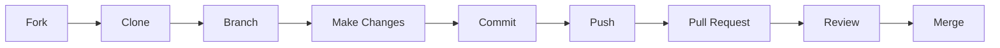

# Awesome OpenClaw 贡献者指南

欢迎贡献 Awesome OpenClaw！本指南将帮助你了解如何有效地参与项目。

## 📋 目录

- [快速开始](#快速开始)
- [贡献类型](#贡献类型)
- [工作流程](#工作流程)
- [编码规范](#编码规范)
- [提交规范](#提交规范)
- [Pull Request 指南](#pull-request-指南)
- [社区准则](#社区准则)
- [获得帮助](#获得帮助)

---

## 快速开始

### 第一次贡献？

欢迎！我们很高兴有你加入。以下是快速入门步骤：

1. **Fork 仓库**
   ```bash
   # 点击 GitHub 页面右上角的 Fork 按钮
   ```

2. **克隆你的 Fork**
   ```bash
   git clone https://github.com/YOUR_USERNAME/awesome-openclaw.git
   cd awesome-openclaw
   ```

3. **创建分支**
   ```bash
   git checkout -b add-my-project
   ```

4. **进行更改**
   - 按照下面的指南编辑文件

5. **提交更改**
   ```bash
   git add .
   git commit -m "Add: awesome project"
   ```

6. **推送到你的 Fork**
   ```bash
   git push origin add-my-project
   ```

7. **创建 Pull Request**
   - 访问 GitHub 仓库页面
   - 点击 "Compare & pull request" 按钮

---

## 贡献类型

我们欢迎多种类型的贡献：

### 1. 添加新项目

**最受欢迎的贡献类型！**

**筛选标准**：
- ⭐ Stars > 10（核心项目除外）
- 📅 Last updated within 6 months（历史重要项目除外）
- ✅ 有清晰的 README 或文档
- 🔧 可运行的代码（不是 demo/placeholder）
- 👥 有社区使用（issues, PRs, forks）

**添加位置**：
- 阅读项目描述，确定最合适的分类
- 如果不确定，可以选择最接近的分类
- 查看[分类说明](docs/taxonomy.md)了解详细定义

**格式**：
```markdown
- [username/repo](https://github.com/username/repo) - Brief description (1-2 sentences)
```

或使用表格格式（核心项目）：
```markdown
| [username/repo](https://github.com/username/repo) | Description | Language |
```

### 2. 更新现有项目

如果发现项目信息需要更新：

- ✅ 链接失效 → 修复或移除
- ✅ 描述过时 → 更新描述
- ✅ 项目已归档 → 添加说明或移除
- ✅ 更改分类 → 移动到更合适的分类

### 3. 改进文档

- 📝 修正错别字和语法错误
- 📝 改进现有描述的清晰度
- 📝 添加更多示例或使用场景
- 📝 完善分类说明

### 4. 翻译

我们支持多语言，欢迎翻译贡献：

**当前语言**：
- 🇺🇸 English (README.md)
- 🇨🇳 简体中文 (README.zh-CN.md)
- 🇰🇷 한국어 (README.ko.md)
- 🇯🇵 日本語 (README.ja.md)
- 🇫🇷 Français (README.fr.md)
- 🇪🇸 Español (README.es.md)
- 🇩🇪 Deutsch (README.de.md)

**添加新语言**：
1. 创建 `README.<lang-code>.md`
2. 从 `README.md` 复制内容并翻译
3. 在所有 README 顶部添加语言切换链接
4. 更新本文件的语言列表

**更新现有翻译**：
- 保持结构一致
- 确保技术术语准确翻译
- 同步更新所有语言版本

### 5. 自动化和工具

改进我们的自动化系统：

- 🔧 GitHub Actions 工作流
- 🔧 脚本和工具
- 🔧 CI/CD 改进
- 🔧 文档生成工具

---

## 工作流程

### 标准工作流程



### 详细步骤

#### 1. 准备

```bash
# 1. Fork 并克隆
git clone https://github.com/YOUR_USERNAME/awesome-openclaw.git
cd awesome-openclaw

# 2. 添加上游远程仓库
git remote add upstream https://github.com/vivy-yi/awesome-openclaw.git

# 3. 创建分支
git checkout -b your-branch-name
```

#### 2. 做出更改

```bash
# 编辑文件
vim README.md  # 或其他文件

# 检查更改
git status
git diff

# 添加并提交
git add README.md
git commit -m "Add: descriptive message"
```

#### 3. 同步上游（可选但推荐）

```bash
# 获取上游更改
git fetch upstream

# 合并上游主分支
git rebase upstream/master

# 解决冲突（如有）
git push origin your-branch-name --force-with-lease
```

#### 4. 创建 Pull Request

```bash
# 推送到你的 Fork
git push origin your-branch-name

# 然后在 GitHub 上创建 PR
```

---

## 编码规范

### Markdown 格式

**列表项**：
```markdown
- [Project Name](https://github.com/user/repo) - Description
```

**表格格式**：
```markdown
| Project | Stars | Description | Language |
|---------|-------|-------------|----------|
| [user/repo](url) |  | Desc | Lang |
```

**链接格式**：
```markdown
- [text](https://github.com/user/repo)
- [text](https://github.com/user/repo) - Description
```

### 描述规范

**好的描述**：
- ✅ 简洁（1-2句话）
- ✅ 说明项目的主要功能
- ✅ 突出独特特性
- ✅ 使用技术术语准确

**示例**：
```markdown
❌ Bad: "A cool bot"
✅ Good: "Personal AI assistant with multi-platform messaging support"

❌ Bad: "OpenClaw but better"
✅ Good: "Ultra-lightweight OpenClaw alternative (~4K LOC) with multi-provider LLM support"
```

### 分类指南

**选择合适分类**：
1. 阅读项目 README
2. 确定主要功能
3. 查看分类定义
4. 选择最相关的分类
5. 如不确定，询问维护者

**交叉引用**：
```markdown
- [user/repo](url) - Description
  - See also: [Related Category](#related-category)
```

---

## 提交规范

### 提交消息格式

我们使用语义化提交消息：

```
<type>(<scope>): <subject>

<body>

<footer>
```

**类型 (type)**：
- `add`: 添加新项目
- `update`: 更新现有项目
- `fix`: 修复错误或问题
- `docs`: 文档更改
- `translate`: 翻译更新
- `chore`: 其他维护任务

**示例**：

```bash
# 添加新项目
git commit -m "add: nanobot to OpenClaw-Inspired Projects"

# 更新项目
git commit -m "update: nanobot description with new features"

# 修复链接
git commit -m "fix: broken link for xyz project"

# 文档
git commit -m "docs: improve contributing guide"

# 翻译
git commit -m "translate: add OpenClaw-Inspired Projects to Korean README"
```

### 提交频率

- ✅ 每个逻辑更改一个提交
- ✅ 频繁提交，小步前进
- ❌ 避免巨大的单次提交
- ✅ 提交前测试（Markdown 语法检查）

---

## Pull Request 指南

### PR 标题

**好的标题**：
```markdown
✅ Add: nanobot to OpenClaw-Inspired Projects
✅ Update: Improve descriptions for security-hardened variants
✅ Fix: Broken link in deployment section
✅ Translate: Add new category to Japanese README
```

**不好的标题**：
```markdown
❌ Update README.md
❌ Changes
❌ Fix bugs
```

### PR 描述模板

使用以下模板：

```markdown
## 类型
- [ ] 添加新项目
- [ ] 更新现有项目
- [ ] 修复问题
- [ ] 改进文档
- [ ] 翻译

## 更改内容
<!-- 简要描述你的更改 -->

## 相关 Issue
<!-- Closes #issue-number -->

## 测试
- [ ] Markdown 语法有效
- [ ] 所有链接可访问
- [ ] 遵循格式规范
- [ ] （如适用）所有语言版本已更新

## 截图
<!-- 如果适用，添加截图 -->

## 检查清单
- [ ] 我已阅读贡献指南
- [ ] 项目符合筛选标准
- [ ] 格式与现有条目一致
- [ ] 链接有效且可访问
```

### PR 审查流程

**时间线**：
1. 提交 PR
2. 自动检查运行（CI）
3. 维护者审查（1-3天）
4. 反馈和讨论
5. 修改和更新
6. 批准并合并

**审查标准**：
- ✅ 符合项目规范
- ✅ 质量标准
- ✅ 无冲突
- ✅ CI 检查通过

---

## 社区准则

### 我们的价值观

- **尊重**：尊重所有贡献者
- **包容**：欢迎不同背景的贡献者
- **协作**：建设性反馈和讨论
- **透明**：开放的决策过程

### 可接受的行为

- ✅ 使用友好和包容的语言
- ✅ 尊重不同的观点和经验
- ✅ 优雅地接受建设性批评
- ✅ 关注对社区最有利的事情
- ✅ 对其他社区成员表示同理心

### 不可接受的行为

- ❌ 使用性化语言或图像
- ❌ 恶意攻击或侮辱性评论
- ❌ 骚扰或恶意攻击
- ❌ 公开或私下骚扰
- ❌ 未经许可发布他人的私人信息
- ❌ 其他不专业或不适当的行为

### 执行

对于违反准则的行为：
1. 第一次：警告
2. 第二次：临时禁言
3. 严重违反：永久禁止

---

## 获得帮助

### 问答

**如果你有疑问**：
1. 查看[现有 Issues](https://github.com/vivy-yi/awesome-openclaw/issues)
2. 搜索[讨论区](https://github.com/vivy-yi/awesome-openclaw/discussions)
3. 创建新的 Issue 或 Discussion

### 联系方式

- **GitHub Issues**: 报告问题、提出建议
- **GitHub Discussions**: 一般讨论、问题
- **Pull Requests**: 代码贡献

### 资源

- [项目 README](README.md)
- [分类说明](docs/taxonomy.md)
- [历史设计文档](docs/plans/)
- [GitHub Actions](.github/workflows/)

---

## 贡献者认可

### 贡献者列表

所有贡献者都将被添加到[贡献者列表](CONTRIBUTORS.md)。

### 成为维护者

活跃的贡献者可以被邀请成为维护者：

**标准**：
- 📊 10+ 合并的 PR
- ⏱️ 3个月以上的活跃参与
- ✅ 高质量贡献
- 🤝 积极的社区参与

**维护者职责**：
- 审查和合并 PR
- 回答问题
- 改进项目
- 引导新贡献者

---

## 常见问题

### Q: 我应该在哪里添加我的项目？

A: 阅读项目描述，确定最合适的分类。如果不确定，查看[分类说明](docs/taxonomy.md)或创建 Issue 询问。

### Q: 为什么我的 PR 还没有合并？

A: 我们会尽快审查。通常需要 1-3 天。如果更长时间没有回应，请随时在 PR 中评论。

### Q: 我可以翻译 README 吗？

A: 当然！我们欢迎所有语言的翻译。请参阅上面的"翻译"部分。

### Q: 如何添加新的语言版本？

A: 创建 `README.<lang-code>.md`，从 `README.md` 复制并翻译，然后更新所有 README 的语言切换器。

### Q: 项目被拒绝的原因是什么？

A: 常见原因包括：
- 不符合筛选标准（stars、活跃度、文档）
- 描述不清楚或不准确
- 放置在不合适的分类
- 链接失效

### Q: 我可以自动化更新吗？

A: 可以！我们欢迎自动化改进。请先创建 Issue 讨论你的想法。

---

## 许可证

贡献的内容将使用与项目相同的 [CC0 1.0](LICENSE) 许可证。

通过贡献，你同意你的贡献可以按照 CC0 许可证使用。

---

## 再次欢迎！

🎉 感谢你的兴趣！我们期待你的贡献。

**下一步**：
1. 选择一个任务
2. Fork 仓库
3. 创建分支
4. 开始贡献！

需要帮助？随时创建 Issue 或 Discussion。

---

**Happy Contributing! 🚀**

*最后更新：2025-02-08*
